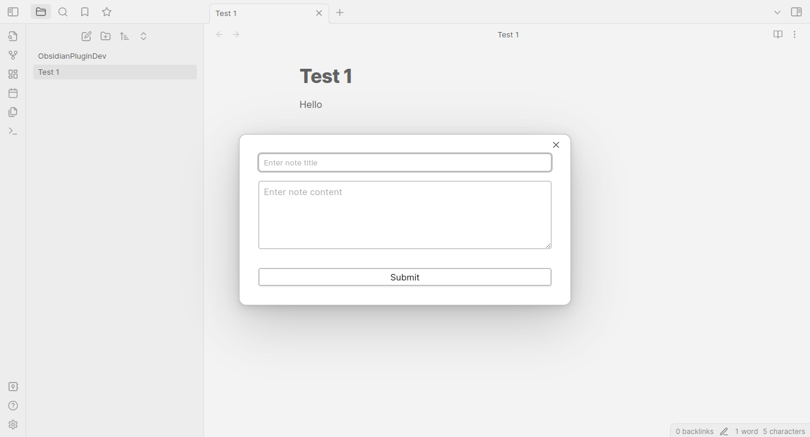

Any feature request/ suggestion for improvement please open [here](https://github.com/tmfelwu/obsidian-inbox/issues). 
https://github.com/tmfelwu/obsidian-inbox/issues

# Demo

The shortcut key launches this modal.



# Usage logic

- [x] Use the shortcut key will trigger the plugin. 
- [x] A modal will open with 'Note Title', 'Note Body' and 'Submit Button'
- [ ] As user types the datalist will show relevant `note path` in the Vault.
- [x] Navigation
  - [x] If the user press `Enter` while the datalist length > 0 the first item in current datalist will be navigated to.
  - [x] Another way is to use up and down arrow key and press `Enter`
- Create New Notes
  - If content is empty and note of the same name doesnt exist
    - [x] Create New Note
  - If content is present.
    - [ ] If note exists with similar name give Notice error.
    - [ ] If note doesnt exist with same name, create the note with content.
- Creating the new notes
  - Press `Ctrl+Enter` or
  - Press `Submit` button at the bottom.

# Setup for OS to associate shortcut key

**Set up a global hotkey using an external tool:**

**For Windows:**

You can use a tool like AutoHotkey to set up a global hotkey. Follow these steps:

1. Install AutoHotkey from https://www.autohotkey.com/.
2. Create a new text file with the extension `.ahk`, e.g., `ObsidianQuickCapture.ahk`.
3. Add the following script to the file (replace `^!c` with your preferred hotkey combination, e.g., `^!c` stands for Ctrl + Alt + C):

```autohotkey
^!c::
Run, obsidian://quick-capture
return
```

4. Double-click the `.ahk` file to run the script. The global hotkey should now be active.

**For macOS:**

You can use a tool like BetterTouchTool or Keyboard Maestro to set up a global hotkey. Here's how to do it with BetterTouchTool:

1. Install BetterTouchTool from https://folivora.ai/.
2. Open BetterTouchTool and go to the "All Apps" section.
3. Click on the "+" button to add a new global shortcut.
4. Press the desired key combination for the hotkey.
5. In the "Trigger Predefined Action" dropdown, select "Controlling Other Applications" > "Open URL / Open URL with Selection".
6. Enter the custom URL `obsidian://quick-capture` and click "Save".

Now the global hotkey should be active and trigger the plugin command from anywhere in your operating system.

**For ubuntu**
On Ubuntu 22.04, you can set up a global hotkey to trigger the Obsidian plugin command using the built-in keyboard shortcut settings.

1. Open the "Settings" application.
2. Click on "Keyboard & Mouse" in the left sidebar.
3. Click on the "Customize Shortcuts" button.
4. Scroll down to the "Custom Shortcuts" section and click the "+" button to add a new shortcut.
5. In the "Add Custom Shortcut" dialog, enter the following information:

   - Name: `Obsidian Quick Capture`
   - Command: `xdg-open "obsidian://quick-capture"`

6. Click the "Add" button to create the custom shortcut.
7. Click on the "Disabled" text next to the new shortcut in the list. Press the desired key combination for the hotkey (e.g., Ctrl + Alt + C).
8. Close the settings application.

Now the global hotkey should be active and trigger the plugin command from anywhere in your operating system.


# Conversation 
Naman - https://chat.openai.com/c/3021e291-47a7-44b0-a0f6-7cc4ad58ba67
